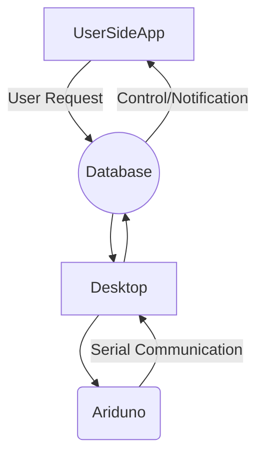

# Welcome to My final year project of (2020)!

Hi! i'm excited to start & share my final year project progression .

# CheckList

- [ ] Desktop
    - [ ] Create UI in pyqt5 for python
    - [ ] Bind with python code 
    - [ ] Write UI functionality 
    - [ ] Configurations store locally Read & Write
    - [ ] Motion Capture store locally Video & Images
    - [ ] Add Firebase and handle internet exception
- [ ] Mobile App
    - [ ] Bind with Firebase
    - [ ] Internet Expection and Offline 
    - [ ] Auth Mobile / E-mail
    - [ ] Profile Type UI , settings and actions 
    - [ ] Save & Share Images 
- [ ]  Arduino
    - [ ] ObjectOrientedProgramming 
    - [ ] Serial Port Communication with python
    - [ ] Servo , Buzzer  , LDR 

## UML diagram

You can render UML diagrams using [Mermaid](https://mermaidjs.github.io/). For example, this will produce a sequence diagram:

